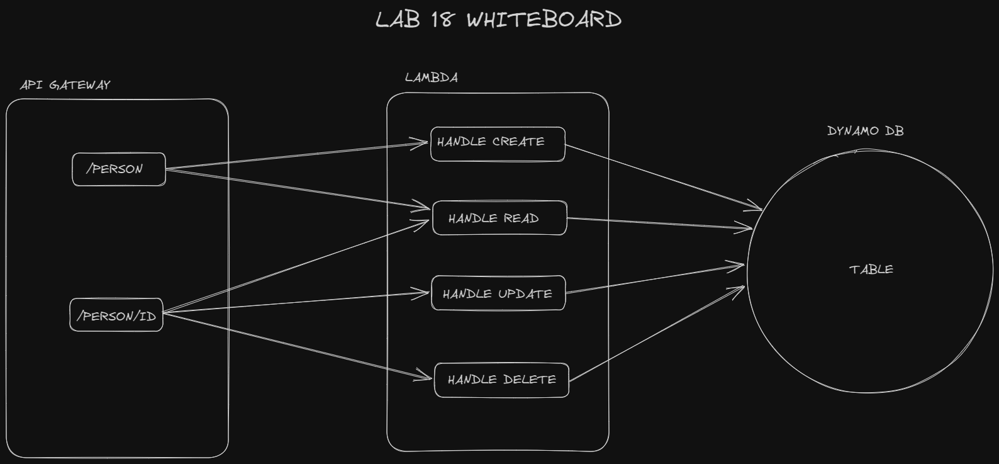

# LAB - Class 18

## Project: serverless-api

### Author: Ryan Eastman

### Problem Domain

Create a serverless REST API.

### Links and Resources

- [GitHub Actions ci/cd](https://github.com/rkgallaway/server-deployment-practice-d51/actions)
<!-- - [back-end server url](http://xyz.com) (when applicable)
- [front-end application](http://xyz.com) (when applicable) -->

### Collaborators

- Ryan Gallaway
- Ike Steoger
- Reece Renninger
- Kaeden O'Meara

### Setup

#### `.env` requirements (where applicable)

for now I have none and do not require one

#### How to initialize/run your application (where applicable)

- e.g. `npm start`

#### How to use your library (where applicable)

#### Features / Routes

- handleRead : checks if an ID is passed as a parameter. If not, returns all records. If so, returns the record with that ID.
- handleCreate : checks if a name is passed as a parameter. If not, returns an error. If so, creates a new record with that name and a random number.
- handleUpdate : checks if an ID and name are passed as parameters. If not, returns an error. If so, updates the record with that ID to have the new name.
- handleDelete : checks if an ID is passed as a parameter. If not, returns an error. If so, deletes the record with that ID.

#### Tests

- How do you run tests?
- Any tests of note?
- Describe any tests that you did not complete, skipped, etc

#### UML

- 

